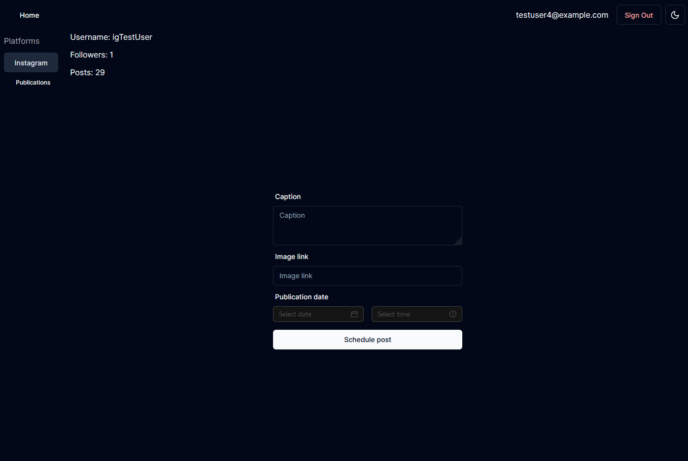
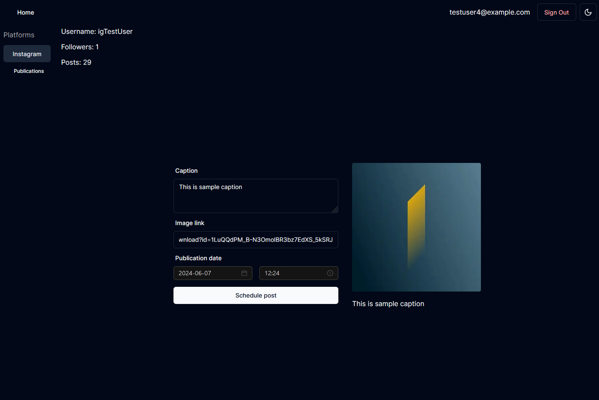
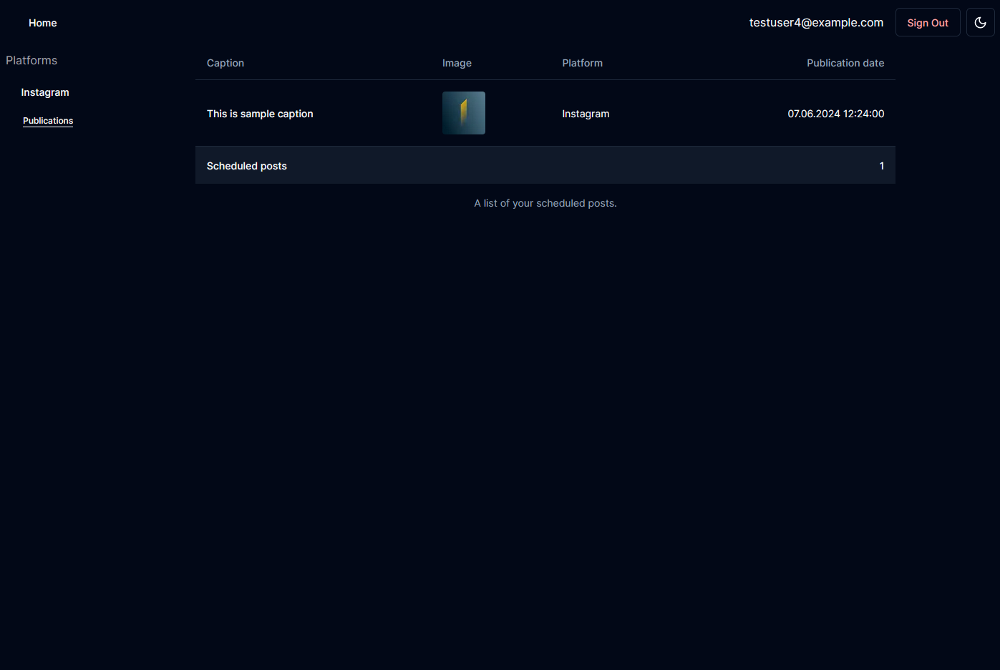

# Social Media Manager

## Social Media Manager
### (work in progress)
Social Media Manager helps You to mange your social media accounts by allowing to to schedule Instagram content. 
Chose precise date and time of publication and worry of nothing else.

## UI
### Schedule post

### Preview

### Scheduled publications

### Tech

